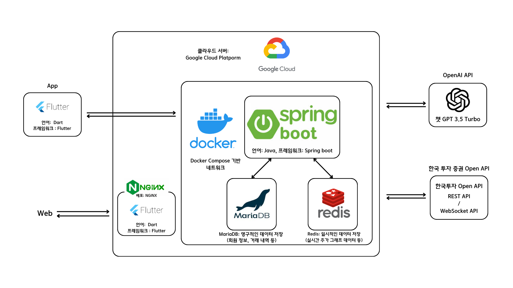

# WithYou - AI와 주식 Open API를 활용한 주식 모의투자 앱

> **AI와 주식 Open API, 스마트폰 기능을 활용한 주식 및 투자 연습 도구**

---

## 목차

1. [프로젝트 개요](#프로젝트-개요)  
2. [기능 소개](#기능-소개)  
3. [기술 스택](#기술-스택)  
4. [시스템 아키텍처](#시스템-아키텍처)  
5. [기능 시연](#기능-시연)  

---

## 프로젝트 개요

**WithYou**는 초보 투자자들을 위해 실제 시장 데이터를 기반으로 투자 전략을 실험할 수 있도록 만든 **AI 기반 모의투자 앱**이다.  
단순히 시세를 확인만 하는게 아니라 **실제 주식 시세 API**와 **AI 챗봇**, **로고 인식**, **예약 거래 시스템**을 통합하여 사용자의 **투자 학습과 실전 감각을 향상**시키는 것을 목표로 한다.

- **실제 데이터를 기반**으로 한 가상 거래  
- 챗봇을 통한 주식 개념 질의응답
- 챗봇과 **자체 구현 기능을 연계**한 실제 데이터 응답 (주식 시세, 순위 등)
- **뉴스 요약** 기능으로 투자 정보 습득  
- 카메라 기반 **로고 인식**으로 기업 탐색  

---

## 기능 소개

### 1. 실시간 주식 데이터 제공
- 한국투자증권 OpenAPI를 활용해 실시간 시세와 주가 데이터를 수집  
- 서버에서 캐싱하여 효율적인 데이터 제공  

### 2. AI 뉴스 요약 및 챗봇
- OpenAI GPT-3.5 Turbo를 활용한 AI 챗봇 연동  
- 주식 개념, 실시간 정보 질문 응답  
- 뉴스 요약 제공 (주요 종목 관련 기사 등)  

### 3. 모의투자 기능
- 가상 자산으로 매수/매도 가능  
- 분봉/일봉 차트 및 주가 그래프 시각화  
- 예약 거래 기능 포함  

### 4. 로고 인식 기능
- Flutter 앱에서 스마트폰 카메라를 통해 로고 인식  
- AR 형태로 관련 주식 정보, 시세, 기업 설명 제공  

---

## 기술 스택

### 백엔드 (Spring Boot)
- Java, Spring Boot (REST API 서버 구성)  
- JPA (MariaDB 연동)  
- Redis 캐시 시스템  
- WebSocket (실시간 알림)    

### 배포 구조
- Docker, Docker Compose  
- Google Cloud Platform (GCP 배포)  
- Nginx (Web 서비스 역방향 프록시 및 정적 호스팅)  

### 프론트엔드
- utter (모바일 및 웹 동시 대응)  
- Dart 언어 기반
- http (REST API 요청)
- provider 상태관리
- fl_chart , syncfusion_flutter_charts 라이브러리 사용하여 데이터 시각화
- web_socket_channel (실시간 WebSocket 통신)
  
### AI & 외부 API
- OpenAI GPT-3.5 Turbo API  
- 한국투자증권 OpenAPI (REST 및 WebSocket)

---

## 시스템 아키텍처

![시스템 구성도]  

- **Spring Boot** 서버는 REST 및 WebSocket API 제공  
- **MariaDB**는 사용자 정보, 거래 기록, 종목 정보 저장  
- **Redis**는 주식 캐시, 예약 거래 큐 처리 등에 사용  
- **Docker Compose** 기반으로 전체 백엔드 서비스 통합  
- Flutter 앱과 웹은 각각 서버와 통신하여 기능 실행  

---

## 기능 시연
### 백엔드 GitHub 링크  
[withYouBE (Spring Boot)](https://github.com/Urasica/withYouBE)

### 📽 시연 영상
[▶️ 유튜브 시연 영상 보기](https://youtu.be/MdASFg5RunY?si=fSKkqbFd2yMPpxcE)
### 주요 기능 GIF
- [추가 예정] 모의투자 인터페이스  
- [추가 예정] 챗봇 질의응답 예시  
- [추가 예정] 로고 인식 및 정보 표시 화면  

